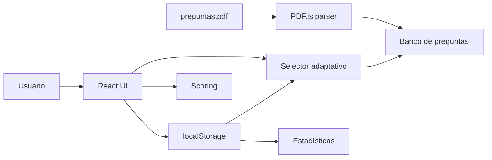

# Oposiciones SCS · Auxiliar Administrativo

Aplicación web para preparar pruebas de **Grupo Auxiliar de la Función Administrativa del Servicio Canario de la Salud (SCS)**.

El proyecto combina un banco de 300 preguntas, práctica por temas, selección adaptativa, estadísticas de progreso y persistencia local sin necesidad de cuenta ni backend.

## Demo

**GitHub Pages:**  
https://emh01.github.io/oposiciones-aux-admin-salud/

## Funcionalidades

- **300 preguntas** organizadas en 16 bloques temáticos
- **Selección adaptativa** que prioriza preguntas no vistas, falladas o con bajo nivel de dominio
- **Modo examen** sin feedback inmediato
- **Modo estudio** con feedback durante la práctica
- **Penalización configurable**: cada 3 respuestas incorrectas restan 1 acierto
- **Filtro por temas**
- **Estadísticas de progreso** y precisión por tema
- **Historial de tests**
- **Exportación / importación** del progreso en JSON
- **Persistencia local** mediante `localStorage`
- **Carga y parsing de preguntas desde PDF** con PDF.js
- **Sin servidor ni registro de usuario**

## Development approach

This project was developed through an **AI-assisted prototyping workflow**.

I defined and iterated the product requirements, study logic, user flows, adaptive-practice behavior, persistence model, validation criteria, and deployment goals. Most of the frontend implementation was generated and refined with AI assistance.

The project is therefore best understood as evidence of **product thinking, technical specification, validation, and effective AI-assisted development**, rather than as a claim of frontend specialization.

## Arquitectura



El navegador mantiene todo el progreso localmente. No hay base de datos, autenticación ni API propia.

## Selección de preguntas

Las preguntas se clasifican en cuatro niveles:

- nunca vistas
- falladas
- vistas con dominio bajo
- vistas con dominio alto

Cada grupo recibe un peso diferente y el selector realiza una **permutación aleatoria ponderada**. Las preguntas de mayor prioridad tienen más probabilidad de aparecer antes, pero ninguna queda completamente excluida.

Las claves históricas de `localStorage` conservan el identificador interno `sas` por compatibilidad con usuarios que ya tenían progreso guardado antes de normalizar el nombre del producto a SCS.

## Temas incluidos

| # | Tema |
|---|---|
| 1 | Prevención de Riesgos Laborales |
| 2 | Autonomía del Paciente |
| 3 | Estatuto Marco del Personal Estatutario |
| 4 | Procedimiento Administrativo Común |
| 5 | Tarjeta Sanitaria Canaria |
| 6 | Información y Atención al Ciudadano |
| 7 | Historia Clínica y Documentación |
| 8 | ODDUS — Derechos de los Usuarios |
| 9 | Protección de Datos Personales |
| 10 | Seguridad Social |
| 11 | Almacenes y Suministros |
| 12 | Contratos del Sector Público |
| 13 | Retribuciones y Nóminas |
| 14 | Certificados y Copias |
| 15 | Listas de Espera |
| 16 | Informática y Ofimática |

## Stack

- **React 19**
- **TypeScript**
- **Vite 8**
- **Tailwind CSS 3**
- **Recharts**
- **PDF.js**
- **GitHub Pages**
- **GitHub Actions**

## Desarrollo local

### Requisitos

- Node.js **20.19+** o una versión compatible posterior
- npm

### Instalación

```bash
git clone https://github.com/EMH01/oposiciones-aux-admin-salud.git
cd oposiciones-aux-admin-salud
npm ci
npm run dev
```

La aplicación estará disponible normalmente en:

```text
http://localhost:5173
```

## Quality checks

```bash
npm run lint
npm run build
```

GitHub Actions ejecuta ambos checks en cada pull request y en `main`.

## Despliegue

El despliegue a GitHub Pages es automático desde `main` mediante:

```text
.github/workflows/deploy.yml
```

No es necesario publicar manualmente con `gh-pages`.

## Persistencia y privacidad

El progreso se guarda únicamente en el navegador del usuario:

- historial de tests
- dominio por pregunta
- últimas respuestas
- estadísticas

Los datos pueden exportarse a JSON y restaurarse posteriormente. El proyecto no requiere cuenta y no envía ese progreso a un servidor propio.

## Implementación destacable

### PDF parsing

`src/services/pdfLoader.ts` utiliza PDF.js para:

1. descargar el PDF incluido en `public/`
2. reconstruir líneas a partir de sus coordenadas
3. eliminar ruido de pie de página
4. detectar preguntas y cuatro opciones
5. combinar el contenido extraído con los metadatos de respuesta/tema
6. cachear el resultado en el navegador

### Scoring

La lógica de puntuación está aislada en `src/services/scoring.ts` y soporta examen con o sin penalización.

### Estado local

`src/services/storage.ts` encapsula progreso, historial, importación/exportación y niveles de dominio.

## Limitaciones

- el sistema depende del formato concreto del PDF de preguntas
- el progreso es específico del navegador salvo exportación manual
- el selector adaptativo es heurístico; no pretende ser un modelo psicométrico
- el contenido de las preguntas debe revisarse cuando cambien temarios o normativa

## Licencia

Este repositorio incluye una licencia **CC0 1.0 Universal**, según el archivo [LICENSE](LICENSE).
